# Paint-by-Numbers Generator

This project turns a source image into a printable, painter-friendly guide: a sketch, a gridded transfer sheet, a color-mixed paint map, staged painting pages, one-page-per-color instructions, and optional centerline SVGs for plotting.

The goal is not just to make a coloring-book poster. The goal is to create a workbook that helps someone actually paint the image: what to mix, where to put it, what has already been painted, and what the canvas should look like after each color.

<p align="center">
  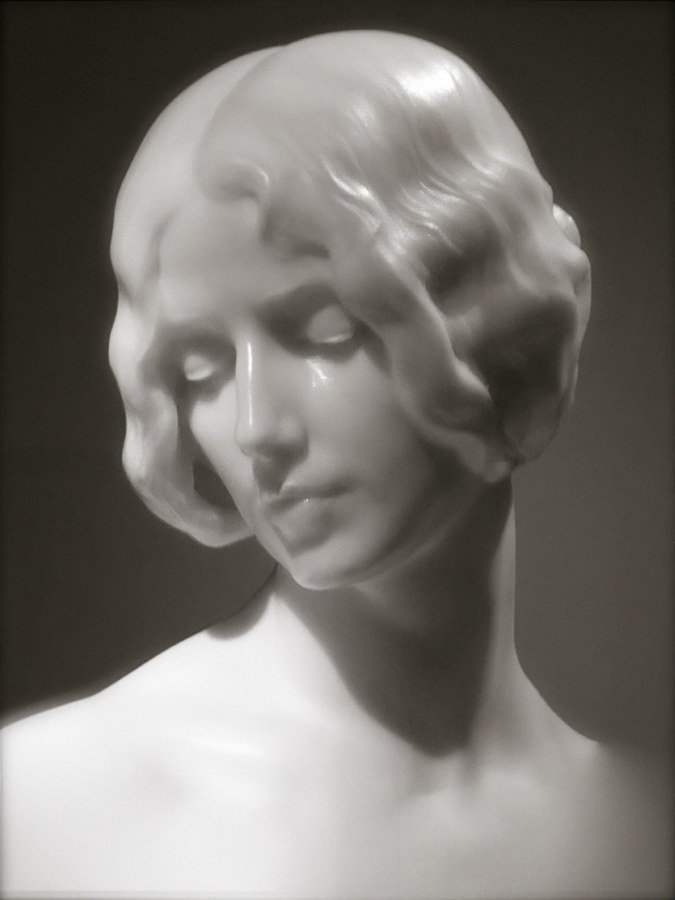
  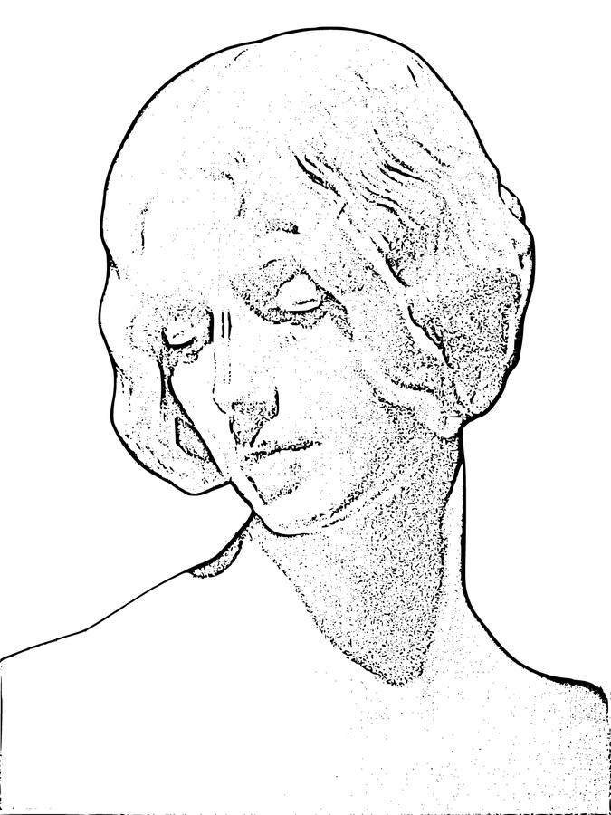
</p>

The current default run uses `pics/33.jpg` as the source image and `pics/33_sketch.png` as the supplied line sketch. The generated guide in this repository is:

[paint_by_numbers_guide_1.pdf](paint_by_numbers_guide_1.pdf)

---

## What It Produces

The generator creates an A4 landscape PDF. Each page has a job.

### 1. The Overview

The first page gives the complete picture: the original image, the simplified paint-by-numbers result, and the full color key.

<p align="center">
  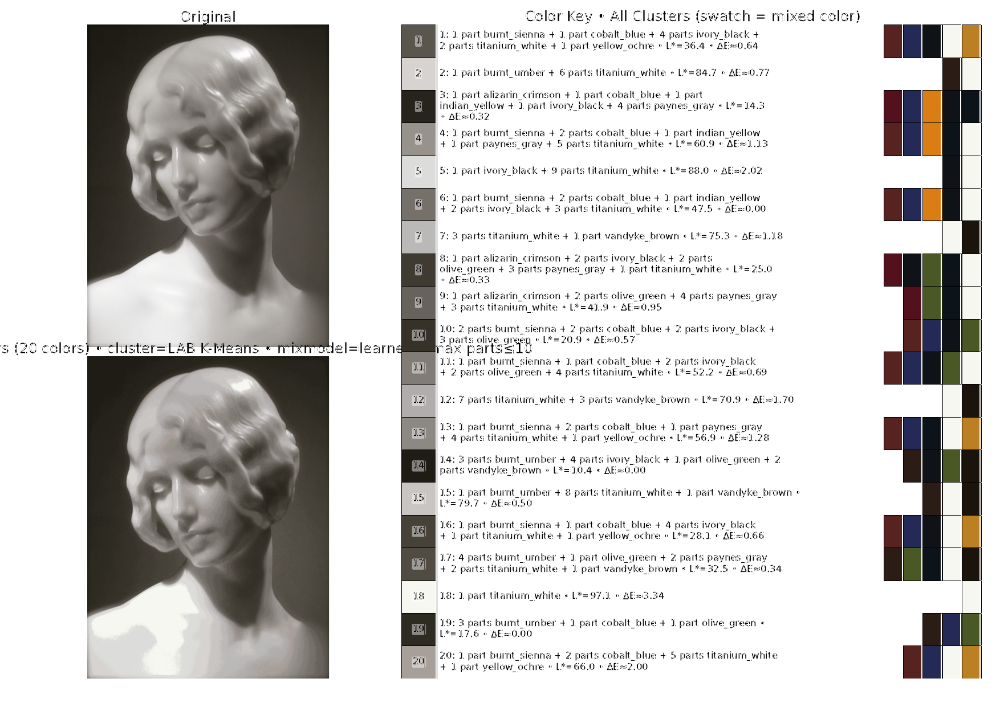
</p>

This is the page you keep nearby when you want the whole painting in your head. It shows the final simplified color structure and every recipe the PDF will use.

### 2. The Transfer Sketch

Before painting, you need a drawing. The guide includes a gridded sketch page for transferring proportions onto canvas or paper.

<p align="center">
  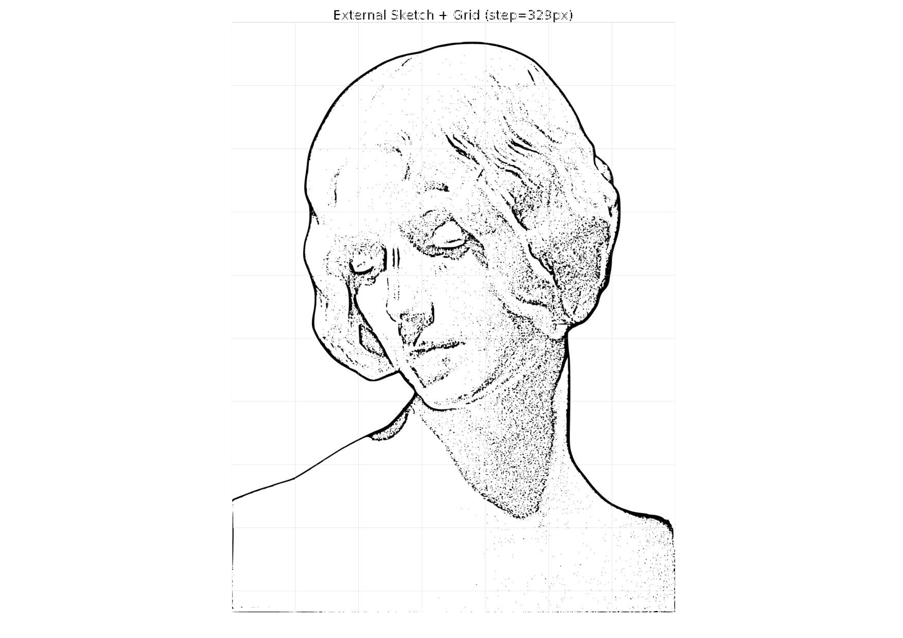
</p>

If `external_sketch` is set in `pbn/config.py`, that sketch is used directly. In the current default config, the supplied sketch is used everywhere the guide needs linework: the transfer page, the painting stages, per-color pages, and centerline SVG tracing.

### 3. Broad Painting Stages

The guide first gives broad stage pages. These are not one-color pages. They are painterly groups: deep shadows, core shadows, midtones, background/neutrals, half-lights, and highlights.

<p align="center">
  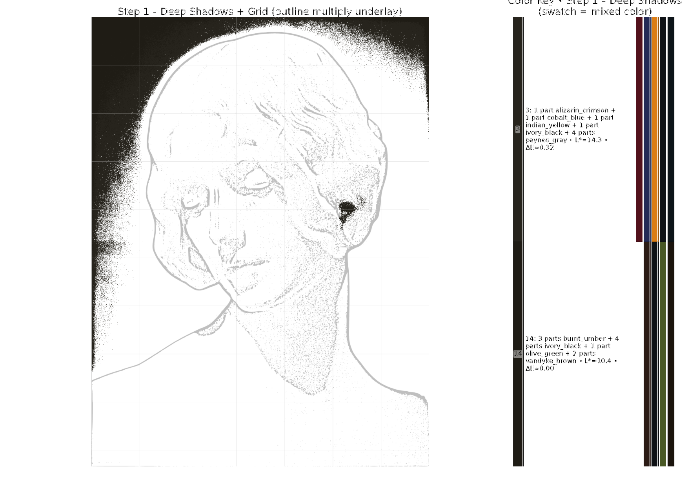
  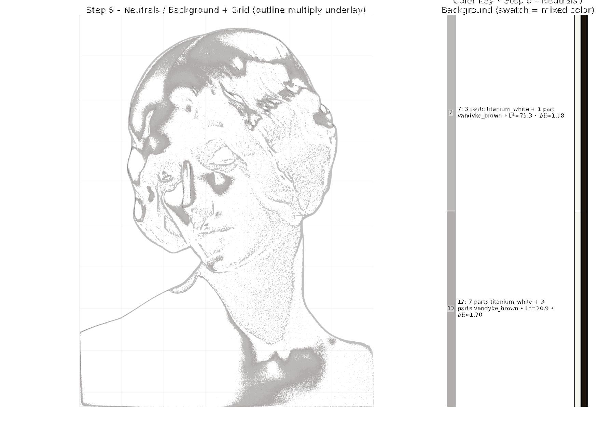
  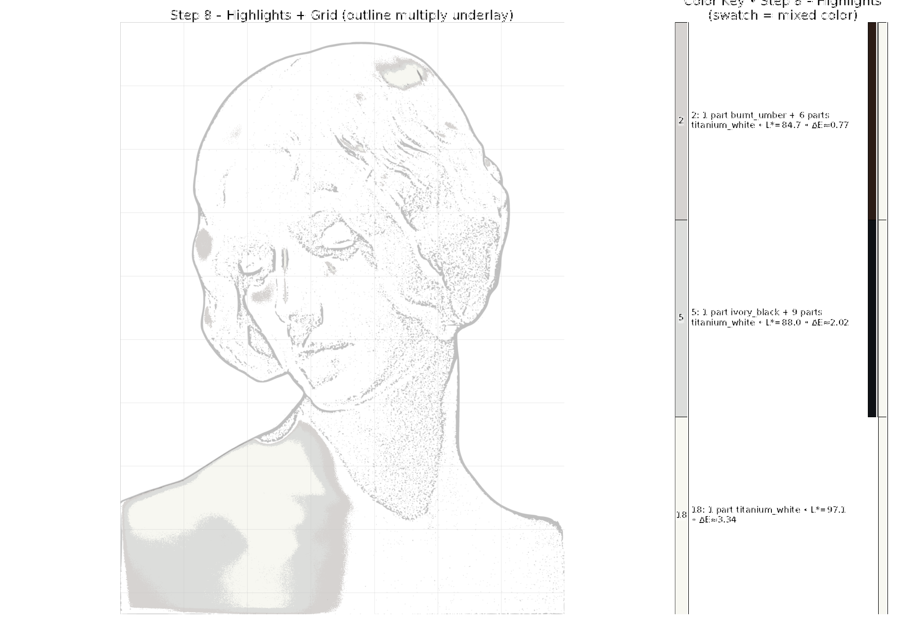
</p>

These stage pages answer the high-level question: "What kind of painting move am I making right now?"

The current default `frame_mode` is `combined`, which blends value-based painting order with practical color grouping. It does not blindly list colors by number. It tries to produce a sane painting sequence: establish dark structure, move through midtones and background, then finish with lights.

### 4. Per-Color Pages With Before And After

After the broad stages, the PDF becomes very specific: one page for each color.

The current per-color layout has three columns:

- Left: the large working frame for this color.
- Middle top: `Painting so far`.
- Middle bottom: `After this color`.
- Right: the recipe and pigment swatches for the current color.

<p align="center">
  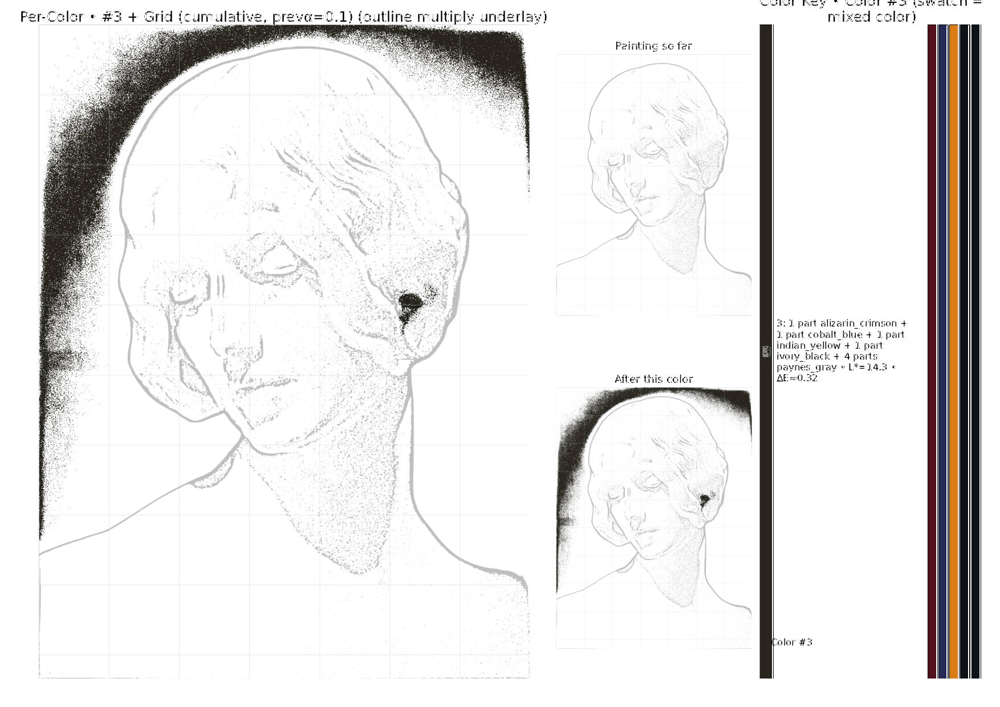
</p>

The useful part is the middle column. You can see the state before painting the current color, then immediately see what the canvas should look like after adding it.

<p align="center">
  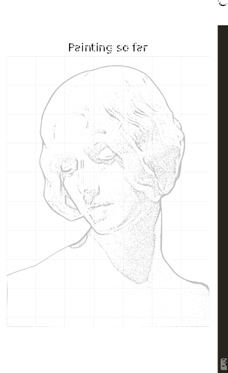
  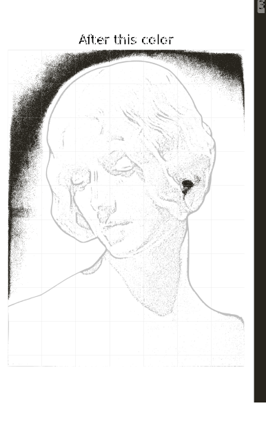
  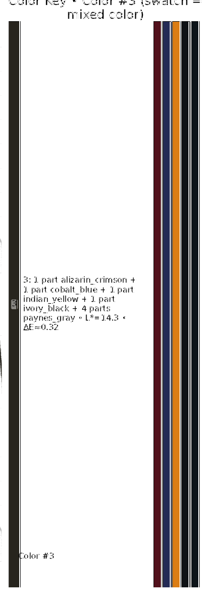
</p>

The sketch stays visible in these previews, using the same configured sketch strength as the main working frame. That makes the previews feel like the actual canvas: partial paint plus the drawing still visible underneath.

Here is the same idea later in the sequence:

<p align="center">
  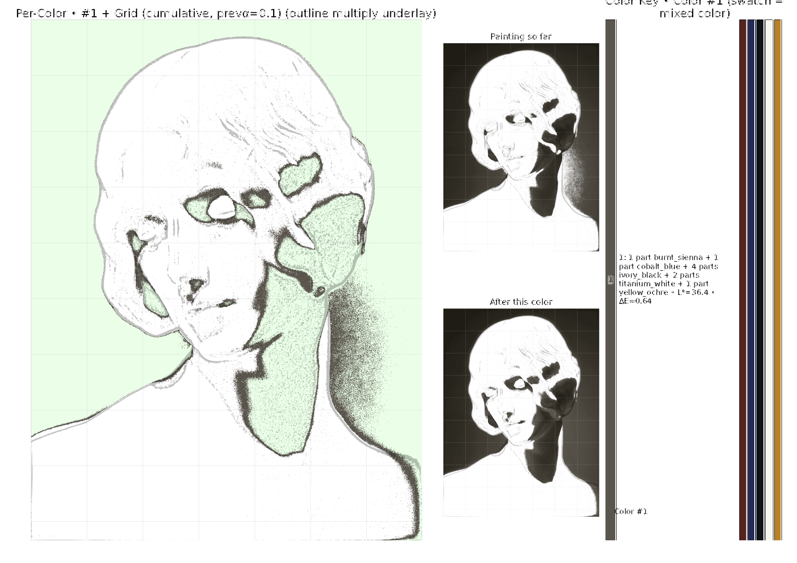
  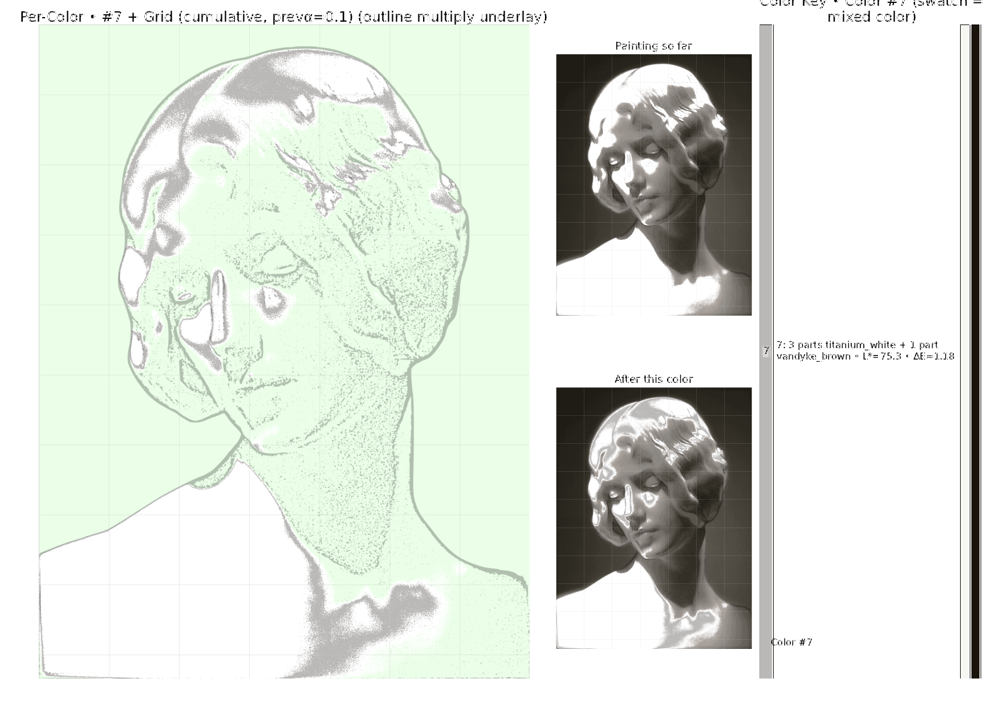
</p>

### 5. The Completed Map

The final PDF page shows the completed simplified painting with the grid.

<p align="center">
  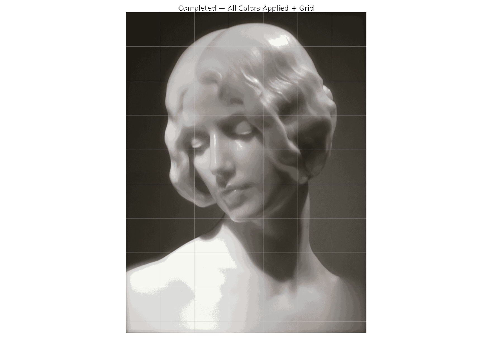
</p>

---

## The Pipeline

The generator is a sequence of practical decisions. Each one exists because a printable paint guide has different needs from a normal image filter.

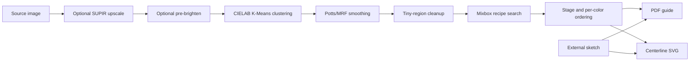

### Image Preparation

The default config starts from `pics/33.jpg`. If the image is too small, the generator can run SUPIR before clustering. In the current sample run, the image was already large enough:

```text
SUPIR upscale check: longest=3072px >= 3000px -> no upscale.
```

There is also an optional pre-brightening step. The current default keeps the original brightness:

```text
pre_brighten_pct = 0
```

### Color Simplification

The image is clustered in CIELAB color space with K-Means. CIELAB is used because distances in Lab are closer to perceived color differences than raw RGB distances.

The current default extracts:

```python
colors = 20
resize = None
```

That means the guide is built from 20 color clusters and, by default, clustering is run at full image resolution.

### Smoothing Without Losing The Painting

Raw clustering can produce isolated speckles. The generator can run Potts/MRF smoothing after labels are produced:

```python
mrf_smoothing = True
mrf_beta = 7.0
mrf_iterations = 4
```

This nudges neighboring pixels toward agreement while keeping the image tied to the original color clusters. It is not trying to blur the artwork. It is trying to make regions paintable.

### Real Paint Recipes

The color key is built from a real pigment palette, not arbitrary RGB names.

Current default pigments:

- `alizarin_crimson`
- `burnt_sienna`
- `burnt_umber`
- `cobalt_blue`
- `indian_yellow`
- `ivory_black`
- `olive_green`
- `paynes_gray`
- `titanium_white`
- `vandyke_brown`
- `yellow_ochre`

For each cluster, the generator searches integer paint recipes:

```python
components = 5
max_parts = 10
delta_e_method = "colour_ciede2000"
```

So a recipe can use up to 5 pigments and up to 10 total parts. Candidate mixes are evaluated with the learned Mixbox model, then scored against the target cluster color using Delta E. The PDF shows both the mixed swatch and the component pigment chips.

Example recipe text from the generated guide:

```text
1 part alizarin_crimson + 1 part cobalt_blue + 1 part indian_yellow
+ 1 part ivory_black + 4 parts paynes_gray
```

This is why the output feels like a painting plan rather than just a posterized image.

---

## Page Types In The Current PDF

The current generated PDF has 29 pages:

- Page 1: overview and full color key.
- Page 2: external sketch transfer page.
- Pages 3-8: broad painting stages.
- Pages 9-28: one page per color.
- Page 29: completed map.

Per-color pages follow the stepwise order implied by the broader frame sequence:

```python
per_color_frames = True
per_color_order_mode = "stepwise"
per_color_cumulative = True
prev_alpha = 0.10
prev_highlight_mode = "neon_green"
```

The large left frame can show previous areas with a subtle cumulative treatment. The middle previews show the cleaner canvas state before and after the current color.

---

## Centerline SVG Output

The run also exports vector linework:

- [centerline_output.svg](centerline_output.svg)
- [centerline_output_canvas.svg](centerline_output_canvas.svg)

These are intended for plotting or further editing in tools such as Inkscape. The canvas SVG fits the traced sketch and grid into the configured physical canvas dimensions:

```python
canvas_dimensions_mm = (240, 300)
canvas_long_margin_mm = 5.0
grid_step = "auto"
grid_min_cols = 7
```

The generator attempts to use `vpype` if available. If it is not installed, it still writes the raw canvas SVG.

---

## How To Run It

From the repository root:

```powershell
.\venv\Scripts\python.exe paint_by_numbers_generic_v8_pdf.py
```

The compatibility entry point is intentionally small:

```python
from pbn.generator import main

if __name__ == "__main__":
    main()
```

Most options live in [pbn/config.py](pbn/config.py). Edit `DEFAULT_CONFIG` there, then run the script again.

The default output filename is:

```python
pdf = "paint_by_numbers_guide.pdf"
```

In this repository, the latest sample output was renamed to:

```text
paint_by_numbers_guide_1.pdf
```

---

## Common Things To Change

### Use Another Image

Set:

```python
input = "pics/my_image.jpg"
```

If you have your own sketch:

```python
external_sketch = "pics/my_sketch.png"
```

Use dark lines on a light background. The sketch will be resized to the source image size.

### Change Detail Level

Fewer colors are simpler to paint:

```python
colors = 12
```

More colors preserve more detail:

```python
colors = 30
```

There is a real tradeoff. More clusters can look better on screen but produce more mixing, more pages, and more tiny decisions at the easel.

### Simplify Recipes

For simpler paint mixing:

```python
components = 3
max_parts = 6
```

For more accurate color matching:

```python
components = 5
max_parts = 10
```

The current sample uses the more expressive setting.

### Adjust Sketch Strength

The sketch is multiply-blended into colored frames:

```python
sketch_alpha = 0.25
```

Lower values make the sketch lighter. Higher values make it darker and more ink-like.

### Split Foreground And Background

The generator has optional RMBG-2.0 support:

```python
separate_fg_bg = True
```

When enabled, per-color pages can be split into background colors first, then foreground colors seeded with the completed background. The default sample keeps this off.

---

## Why The Guide Is Structured This Way

A normal paint-by-numbers sheet tells you where every number goes. That is useful, but it is not enough if you want to paint calmly.

This generator tries to answer four questions on every page:

1. What color am I painting now?
2. Where does that color go?
3. What should the canvas already look like?
4. What should it look like after this step?

The broad stage pages give orientation. The per-color pages give precision. The sketch keeps the drawing visible. The grid keeps proportions honest. The recipes keep the palette physically mixable.

That is the core idea: turn a complicated image into a sequence of small, paintable decisions.

---

## Repository Layout

```text
pbn/
  generator.py       Main generation pipeline and PDF assembly
  config.py          Default configuration
  image_ops.py       Sketching, grids, cleanup, smoothing helpers
  mixing.py          Recipe search and Mixbox-based mixing
  pdf_render.py      Color key and PDF layout helpers
  svg_trace.py       Centerline SVG tracing

pics/
  33.jpg             Current sample source image
  33_sketch.png      Current sample external sketch

docs/readme/
  *.png              README images rendered from the generated PDF

paint_by_numbers_guide_1.pdf
  Current sample guide
```

---

## Current Sample Run

The sample PDF in this repository was generated with the current default config. The run took about 25 minutes on this machine and ended with:

```text
Saved A4 landscape PDF to paint_by_numbers_guide.pdf
Centerline SVG with grid saved: centerline_output.svg
Centerline canvas SVG saved: centerline_output_canvas.svg
Total time: 1497.90s
```

The generated sample was then renamed to:

```text
paint_by_numbers_guide_1.pdf
```

