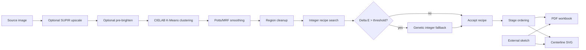

# Paint-by-Numbers Generator

This repository turns a source image into a printable, painter-friendly paint-by-numbers workbook. It does not stop at posterizing an image. It builds a full guide: clustered color map, real-paint recipes, transfer sketch, staged painting pages, per-color pages, before/after progress previews, recipe diagnostics, and optional centerline SVGs for plotting.

The first thing the generator gives you is the thing you actually care about: the finished workbook view, with the simplified painting and the paint recipes beside it.

<p align="center">
  
</p>

The current sample guide is included here:

[paint_by_numbers_guide_1.pdf](paint_by_numbers_guide_1.pdf)

---

## What This Is

The project answers a practical painting question:

> Given an image, how do I turn it into a sequence of paintable decisions?

The PDF is designed to help a painter know:

1. What the final simplified painting should look like.
2. Which physical pigments to mix for each color.
3. Where each color goes.
4. What has already been painted.
5. What the canvas should look like after the current color.
6. How to transfer the drawing and grid.

That is why the output is a workbook rather than a single image.

---

## The Current Output

The generator creates an A4 landscape PDF. A current run has this broad structure:

- Page 1: overview, source, clustered painting, and full color key.
- Page 2: transfer sketch with grid.
- Pages 3-8: broad painting stages.
- Pages 9-28: one page per color.
- Final page: completed paint map.
- Extra files: centerline SVGs for plotting/editing.

### Overview And Color Key

The overview page is the main reference page. It shows the source image, the simplified paint map, and every recipe.

<p align="center">
  
</p>

This is the page to keep nearby when you want the whole painting in your head.

### Source And Sketch

The current default source image and supplied sketch are:

<p align="center">
  
  
</p>

The sketch is not the main output; it is part of the process. It is used for transfer, for linework under the painting frames, and for centerline SVG tracing.

### Transfer Sketch

The transfer sketch page gives you a gridded drawing that can be copied onto canvas or paper.

<p align="center">
  
</p>

If `external_sketch` is set in [pbn/config.py](pbn/config.py), the generator uses that exact sketch instead of generating linework from image edges.

### Broad Painting Stages

Before the one-color pages, the guide gives broader painting stages. These are useful because painters often work by value and structure before chasing every small color region.

<p align="center">
  
  
  
</p>

The default stage mode is:

```python
frame_mode = "combined"
```

That means the generator combines value-based staging with practical color grouping. The intent is a reasonable painting order: establish dark structure, build midtones and background, then add lighter regions.

### Per-Color Pages

Each per-color page is a working instruction sheet for one color.

<p align="center">
  
</p>

The current code layout is:

- Column 1: large working frame for the current color.
- Column 2 top: `Painting so far`.
- Column 2 bottom: `After this color`.
- Column 3 top: completed painting reference.
- Column 3 bottom: recipe, mixed swatch, and pigment components.

The middle column exists because it is easy to lose orientation on a long paint-by-number sequence. You can see the canvas before this color and after this color without mentally reconstructing the whole process.

<p align="center">
  
  
  
</p>

Later pages show the same idea after more colors have accumulated:

<p align="center">
  
  
</p>

### Completed Map

The final PDF page shows the completed simplified painting with the grid.

<p align="center">
  
</p>

---

## Pipeline

The generator is a chain of image-processing, color-matching, and layout steps.



---

## Color Clustering

The image is clustered in perceptual CIELAB space with K-Means:

```python
colors = 20
resize = None
```

`colors = 20` means the image is reduced to 20 paint colors. `resize = None` means clustering uses the full-resolution image rather than a smaller proxy.

CIELAB is used because it is closer to human color perception than raw RGB distances. This matters because a small numerical RGB difference can be perceptually large, and a large RGB difference can sometimes be perceptually modest.

After clustering, the label map is upsampled to full image size and can be smoothed.

---

## Region Smoothing

Raw K-Means often creates speckles: tiny isolated islands of color. The generator can run a Potts/MRF-style smoothing pass:

```python
mrf_smoothing = True
mrf_beta = 7.0
mrf_iterations = 4
```

The smoothing step balances two goals:

- Keep pixels close to their clustered color.
- Encourage neighboring pixels to share labels.

This makes the result more paintable without simply blurring the image.

There is also optional region cleanup:

```python
min_region_px = 0
min_region_pct = 0.0
```

Those can be increased when you want tiny connected components merged into neighboring regions.

---

## Paint Mixing Model

The generator does not use arbitrary color names. It searches recipes from a real pigment palette:

```python
BASE_PALETTE = {
    "alizarin_crimson": ...,
    "burnt_sienna": ...,
    "burnt_umber": ...,
    "cobalt_blue": ...,
    "indian_yellow": ...,
    "ivory_black": ...,
    "olive_green": ...,
    "paynes_gray": ...,
    "titanium_white": ...,
    "vandyke_brown": ...,
    "yellow_ochre": ...,
}
```

Each candidate recipe is mixed with the Mixbox model. Mixbox is used because physical pigment mixing is nonlinear. Simple RGB averaging is not good enough for paint.

The default first-pass search is still deterministic and exhaustive:

```python
components = 5
max_parts = 10
```

That means the first pass tries integer recipes up to 10 total parts and up to 5 pigments.

Example recipe:

```text
1 part burnt_sienna + 2 parts cobalt_blue + 5 parts titanium_white + 1 part yellow_ochre
```

The result is scored with Delta E.

---

## Delta E

Delta E is the color difference between:

- the target cluster color, and
- the predicted mixed-paint color.

The current default method is:

```python
delta_e_method = "colour_ciede2000"
```

Lower is better. In practical terms:

- `Delta E <= 1.0`: excellent digital match.
- `Delta E ~ 1-2`: visible but often acceptable.
- `Delta E > 2`: worth investigating or retrying.

Important caveat: Delta E here measures the software model. It does not guarantee your physical tube paints will match perfectly. The model predicts from RGB pigment constants and Mixbox. Real paint tubes can behave differently, especially in tints with strong pigments.

---

## Genetic Algorithm Fallback

The newest recipe logic is:

```text
normal exhaustive integer search
if Delta E <= 1.0:
    accept recipe
else:
    run genetic integer optimizer
```

The genetic fallback exists because some colors cannot be matched well inside the smaller `10 parts / 5 pigments` first-pass search.

The genetic fallback searches a larger integer recipe space:

```python
genetic_retry_enabled = True
genetic_retry_delta_e = 1.0
genetic_retry_max_parts = 20
genetic_retry_components = 10
genetic_retry_population = 180
genetic_retry_generations = 160
```

It works directly on integer recipes. That is important. A continuous optimizer can find fractional paint weights like `0.613 titanium_white`, but those are not useful at the palette. The genetic optimizer searches recipes that are already printable as whole parts.

A recipe is represented internally like an integer vector:

```text
[alizarin, sienna, umber, cobalt, indian_yellow, black, olive, paynes, white, vandyke, ochre]
```

The genetic optimizer uses:

- a population of candidate recipes,
- parent selection weighted by lower Delta E,
- crossover between recipes,
- mutation by moving/adding/removing paint parts,
- elitism so the best candidates are not lost,
- a final one-part local refinement.

For a previously problematic gray target, the old recipe was:

```text
1 burnt_sienna + 2 cobalt_blue + 5 titanium_white + 1 yellow_ochre
Delta E: about 2.00
```

The genetic fallback found recipes below `Delta E <= 1.0`, for example:

```text
1 burnt_sienna + 2 cobalt_blue + 1 indian_yellow + 1 paynes_gray + 7 titanium_white
Delta E: about 0.54
```

This does not solve every real-world paint mismatch, but it makes the digital recipe search much stronger while keeping recipes as integer parts.

---

## Recipe Cache And Probe Scripts

Full PDF generation can take a long time. Recipe experiments should not require rerunning clustering and PDF rendering.

The generator now writes a recipe target cache:

```python
write_recipe_cache = True
recipe_cache = "outputs/recipe_targets.json"
```

The cache stores:

- color number,
- target RGB,
- chosen recipe,
- predicted mixed RGB,
- Delta E,
- optimizer settings.

After a full run, you can inspect a single color without regenerating the PDF:

```powershell
.\venv\Scripts\python.exe scripts\probe_color_recipe.py --color 20 --skip-integer
```

There is also an optimizer comparison script:

```powershell
.\venv\Scripts\python.exe scripts\experiment_integer_optimizers.py
```

That script compares:

- the seed recipe,
- the stochastic integer retry experiment,
- simulated annealing,
- genetic algorithm.

The production generator currently uses only:

```text
integer baseline -> genetic fallback
```

The other methods remain useful for research and comparison.

---

## Progress Reporting

Long runs now print coarse stage markers and progress bars.

Example:

```text
[1/6] Loading image and preparing inputs...
[2/6] Clustering image colors...
[3/6] Smoothing and cleaning color regions...
[4/6] Building paint recipes for 20 colors...
Recipes:  35%|███████             | 7/20
[5/6] Planning painting stages...
[6/6] Rendering PDF pages...
Stage pages: ...
Per-color pages: ...
```

The recipe step is usually the long one, especially when genetic fallback is triggered for hard colors.

---

## PDF Page Logic

### Overview Page

The overview page includes:

- original image,
- simplified paint-by-numbers map,
- complete color key,
- mixed swatches,
- component pigment chips,
- Delta E values.

### Stage Pages

Stage pages group multiple colors by painting logic:

- deep shadows,
- core shadows,
- midtones,
- neutrals/background,
- half-lights,
- highlights.

### Per-Color Pages

Per-color pages are more precise. They show:

- where this exact color goes,
- what has already been painted,
- what the painting should look like after this color,
- a completed reference,
- the recipe and swatches.

Relevant config:

```python
per_color_frames = True
per_color_order_mode = "stepwise"
per_color_cumulative = True
prev_alpha = 0.10
prev_highlight_mode = "neon_green"
```

---

## Centerline SVG Output

The generator also writes:

- [centerline_output.svg](centerline_output.svg)
- [centerline_output_canvas.svg](centerline_output_canvas.svg)

These are useful if you want vector linework for plotting, editing, or transfer workflows.

Current canvas settings:

```python
canvas_dimensions_mm = (240, 300)
canvas_long_margin_mm = 5.0
grid_step = "auto"
grid_min_cols = 7
```

If `vpype` is available, the generator can use it. If not, it still writes the raw SVG.

---

## Running The Generator

From the repository root:

```powershell
.\venv\Scripts\python.exe paint_by_numbers_generic_v8_pdf.py
```

The entry point is intentionally small:

```python
from pbn.generator import main

if __name__ == "__main__":
    main()
```

Most behavior is controlled in:

[pbn/config.py](pbn/config.py)

Default output:

```python
pdf = "paint_by_numbers_guide.pdf"
```

The included sample PDF is:

```text
paint_by_numbers_guide_1.pdf
```

---

## Common Configuration Changes

### Use Another Image

```python
input = "pics/my_image.jpg"
```

### Use Your Own Sketch

```python
external_sketch = "pics/my_sketch.png"
```

Use dark lines on a light background. The sketch will be resized to the source image size.

### Change Number Of Colors

Simpler:

```python
colors = 12
```

More detailed:

```python
colors = 30
```

More colors can preserve detail, but they also produce more recipes, more pages, and more decisions.

### Change First-Pass Recipe Complexity

Simpler first-pass recipes:

```python
components = 3
max_parts = 6
```

More expressive first-pass recipes:

```python
components = 5
max_parts = 10
```

The genetic fallback is separate and only runs when Delta E is above the threshold.

### Change Genetic Fallback Strength

More aggressive:

```python
genetic_retry_population = 240
genetic_retry_generations = 220
```

Faster:

```python
genetic_retry_population = 100
genetic_retry_generations = 80
```

### Adjust Sketch Strength

```python
sketch_alpha = 0.25
```

Lower values make the sketch lighter. Higher values make it stronger.

### Split Foreground And Background

```python
separate_fg_bg = True
```

When enabled, the generator can create background color pages first, then foreground color pages seeded with the completed background.

---

## Practical Caveat About Real Paint

The recipes are model-based. They are better than RGB averaging, but they are still predictions.

Real paint can differ because:

- your tube color may not match the stored palette constant,
- blue pigments can tint strongly when mixed with white,
- titanium white can reveal chroma in a mixture,
- pigment brands vary,
- wet paint and dry paint can differ,
- lighting changes perception.

The generator gives a strong starting point. For important colors, especially pale neutrals containing cobalt/blue, test a small swatch before committing a large area.

---

## Repository Layout

```text
pbn/
  generator.py       Main pipeline and PDF assembly
  config.py          Default configuration
  mixing.py          Mixbox, integer search, genetic fallback
  image_ops.py       Sketch, grid, cleanup, smoothing helpers
  pdf_render.py      Color key and PDF layout helpers
  svg_trace.py       Centerline SVG tracing

scripts/
  probe_color_recipe.py              Probe one color from cache or target RGB
  experiment_integer_optimizers.py   Compare optimizer strategies

pics/
  33.jpg             Current sample source image
  33_sketch.png      Current sample external sketch

docs/readme/
  *.png              README images rendered from the generated PDF

outputs/
  recipe_targets.json                Recipe target cache after generation

paint_by_numbers_guide_1.pdf
  Included sample guide
```

---

## Current Sample Run

A representative run prints:

```text
SUPIR upscale check: longest=3072px >= 3000px -> no upscale.
Pre-brighten skipped (pre_brighten_pct=0).
Applying Potts/MRF label smoothing (beta=7.0, iterations=4).
Recipe target cache saved: outputs/recipe_targets.json
Saved A4 landscape PDF to paint_by_numbers_guide.pdf
Centerline SVG with grid saved: centerline_output.svg
Centerline canvas SVG saved: centerline_output_canvas.svg
```

On this machine, full generation has typically taken tens of minutes, depending on recipe-search settings and how many colors trigger the genetic fallback.

